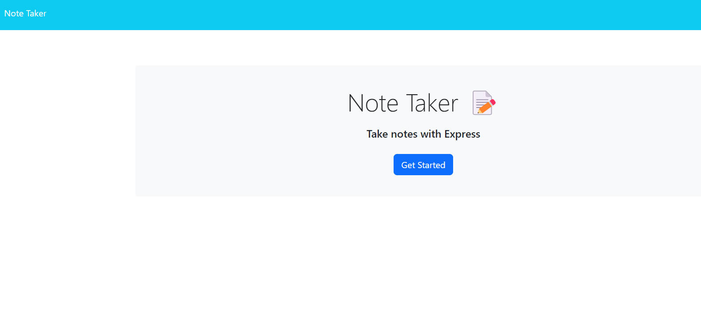
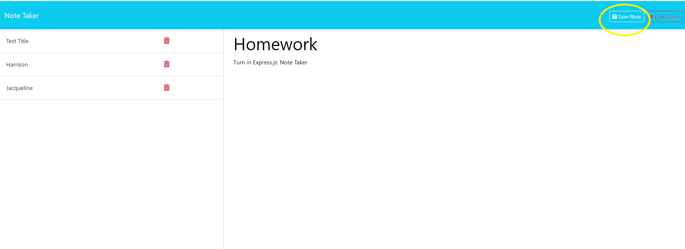
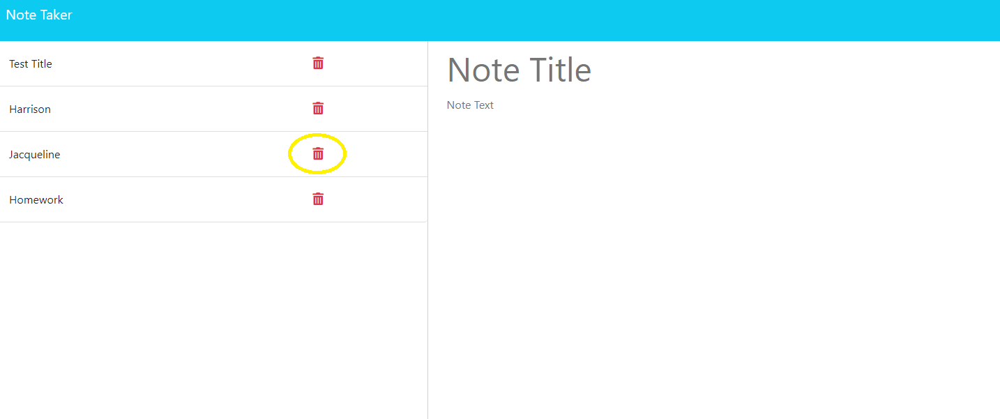
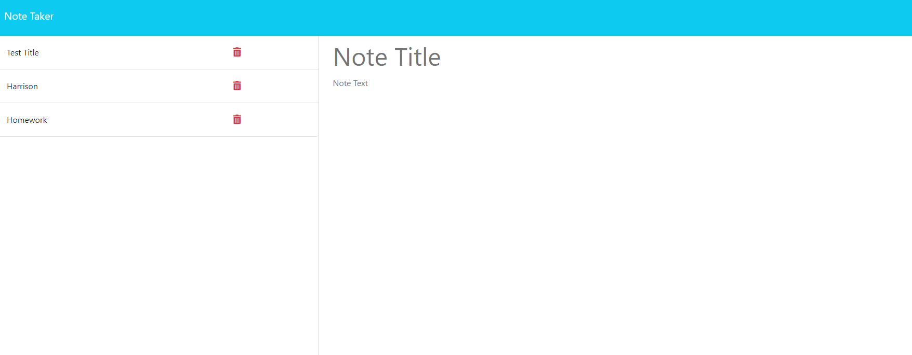

# Express.js: Note Taker

Deployed link for [Express.js: Note Taker](https://notes-c11-41cccd7ba73f.herokuapp.com/)

## Table of Contents (Optional)

* [Installation](#installation)
* [Usage](#usage)
* [Credits](#credits)
* [License](#license)

## Installation

##### No special installation required, just visit [https://notes-c11-41cccd7ba73f.herokuapp.com/](https://notes-c11-41cccd7ba73f.herokuapp.com/)

## Usage 

1.	Open website [https://notes-c11-41cccd7ba73f.herokuapp.com/](https://notes-c11-41cccd7ba73f.herokuapp.com/)
2.	Click on the [Get Started] button.
3.	Add your Note Title in the box on the right side of the screen.
4.	Then add any extra information for the note in the text porton below the title.
5.	Click Save Note on the top right hand side of the screen (next to the scroll bar).
6.  You will see the note added to the list on the left hand side of the screen.
        * When you have finished with a note clock the red trash can and it will be deleted.

## Credits

* Git - [https://git-scm.com/](https://git-scm.com/)    
* Javascript - [https://developer.mozilla.org/en-US/docs/Web/JavaScript](https://developer.mozilla.org/en-US/docs/Web/JavaScript)
* jQuery - [https://jquery.com](https://jquery.com)
* Node.js - [https://nodejs.org/en](https://nodejs.org/en)
* Express 4.16.4 - [https://expressjs.com/](https://expressjs.com/)
* Heroku - [https://devcenter.heroku.com/categories/reference](https://devcenter.heroku.com/categories/reference)

## License

[MIT License](https://github.com/microsoft/vscode/blob/main/LICENSE.txt)

